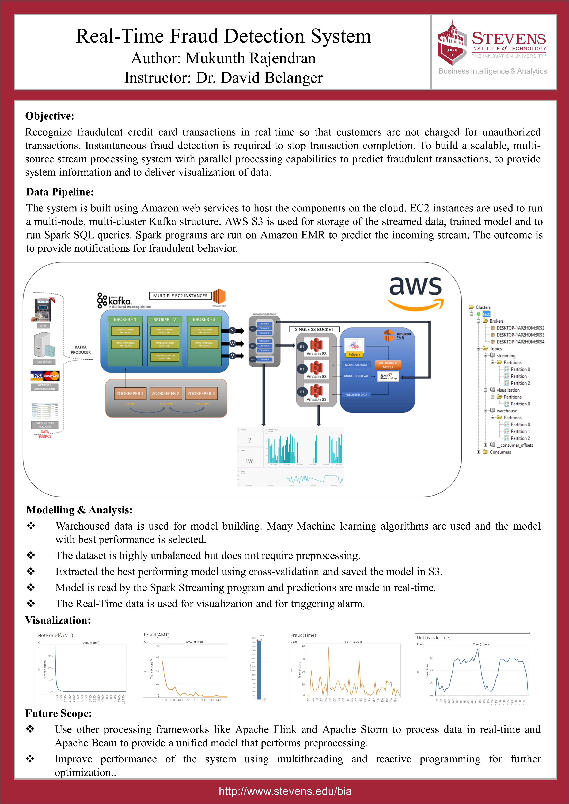

# Real-Time Fraud Detection System
## Authors

* **Mukunth Rajendran** 
(https://github.com/MukunthR)

* **Data Source : Kaggle**
[Credit Crard Faud](https://www.kaggle.com/mlg-ulb/creditcardfraud)

## Project Poster

## Project Development Dependencies
* **Apache Kafka**
* **PySpark**
* **AWS Credentials**
* *AWS paid services like EC2 instances, S3 Bucket, EMR, Cloud Watch, SNS were used towards completing the project work*

[Project Working](https://www.youtube.com/watch?v=tA8sUxFhMcg)
